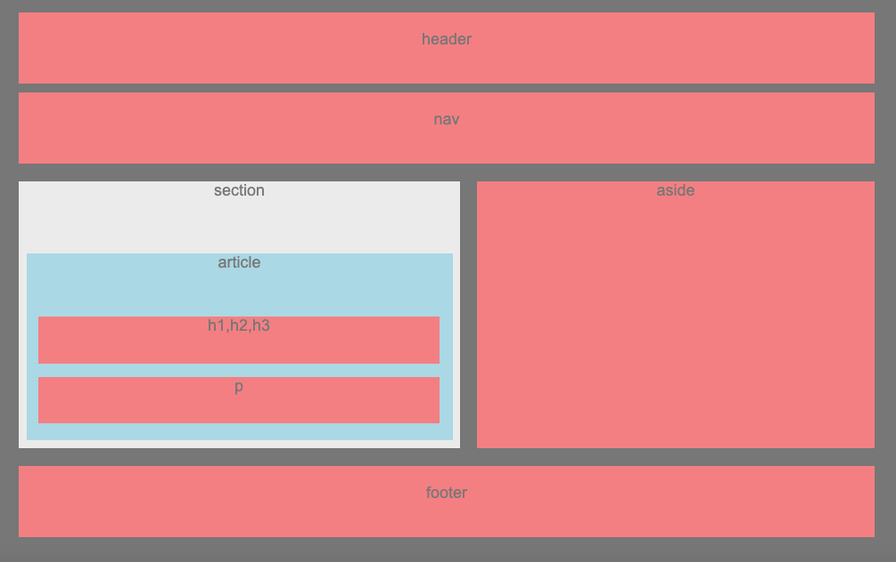

# HW-wireframe

## Screen Shot

## Technologies Used
- HTML - used to create elements on the DOM
- CSS - styles html elements on page
- Git - version control system to track changes to source code
- GitHub - hosts repository that can be deployed to GitHub Pages

## Summary
This application practices wireframing a bunch of boxes

## Code Snippet
'''html
<body>
  

    <header>header
    </header>

    <nav>nav
    </nav>

    

      <section id="section">section
        
        <article id="article">article
          
          <article id="h">h1,h2,h3
          </article>

          <article id="p">p
          </article>
        
        </article>
      </section>

      <aside id="aside">aside
      </aside>

    

    <footer>footer
    </footer>

  

</body>

## Author Links
[GitHub](https://github.com/flexsant)